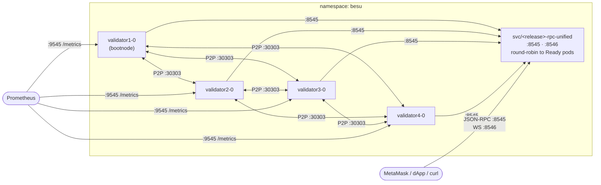

# Besu Sandbox Network

A four-validator Hyperledger Besu private network for Kubernetes — one
`helm install`, free gas, deterministic keys, and a unified RPC entrypoint for
MetaMask and local dApp work.

> **Not for production.** Validator and dev-account private keys are committed
> in plaintext in this chart. Use only on local or disposable clusters.

## Architecture



Validators 2–4 have an `init-bootnode` init container that polls
`<release>-validator1:8545/liveness` before starting — validator 1 must be Ready first.
Each validator also gets its own Service (`svc/<release>-validator<N>`) used
for stable DNS, Prometheus scraping, and direct per-node access.

## Requirements

- **[Helm](https://helm.sh/docs/) >= 3** (Helm 3.x and 4.x) — the chart uses
  `apiVersion: v2` and Helm 3+ templating (`include`, `until`, etc.). Helm 2 is
  not supported.
- **Kubernetes 1.21+** — uses `apps/v1` StatefulSets and
  `rbac.authorization.k8s.io/v1` Role/RoleBinding.
- **`kubectl`** configured with access to the target cluster.
- **A running cluster** (e.g. minikube, kind, k3s, or a managed cluster) with
  enough capacity for the validators. Defaults request `100m` CPU / `1024Mi`
  memory and limit `500m` CPU / `2048Mi` memory per validator (4 validators by
  default).
- **A default StorageClass** that can provision `ReadWriteOnce` PVCs — required
  only when `node.storage.persistence=true` (the default). Each validator
  StatefulSet uses `volumeClaimTemplates` (PVC name pattern
  `data-validator<N>-0`). Omit
  `node.storage.storageClass` to use the cluster default, or set it explicitly
  (e.g. `standard`, `gp3`). Set `node.storage.persistence=false` to fall back to
  `emptyDir` and remove this requirement.
- **Cluster RBAC permissions** to create ServiceAccounts, Roles, and
  RoleBindings (the install creates per-validator RBAC).

## Configuration

The chart reads validator keys and genesis `extraData` from `values.yaml`. To
generate a new validator set (example: four nodes) and populate those values,
see **[doc/creating-validators-and-values.md](doc/creating-validators-and-values.md)**.

### Validator node keys (`validatorKeys`)

By default, **node private keys** are in `validators[].nodeKey` and the chart
creates Kubernetes Secrets (sandbox only — plaintext in Git).

For production-style setups, use **`validatorKeys.source`**:

| `source`          | Use case                                                                                                           |
| ----------------- | ------------------------------------------------------------------------------------------------------------------ |
| `values`          | Default — local kind/minikube, deterministic demo keys                                                             |
| `existingSecret`  | You pre-create Secrets named per `validatorKeys.existingSecret.nameTemplate` (Sealed Secrets, CI, …)               |
| `externalSecrets` | [External Secrets Operator](https://external-secrets.io/) sync from **HashiCorp Vault** or **AWS Secrets Manager** |

`pubKey` and `address` stay in `validators[]` in all modes (genesis / enodes).
Full walkthrough: **[doc/validator-keys-and-external-secrets.md](doc/validator-keys-and-external-secrets.md)**  
Example values: **[examples/values-external-secrets.yaml](examples/values-external-secrets.yaml)**

```yaml
validatorKeys:
  source: externalSecrets
  externalSecrets:
    secretStoreRef:
      name: aws-secrets-manager
      kind: ClusterSecretStore
    remoteRef:
      keyTemplate: "besu-sandbox/validator{{n}}"
      property: nodekey
```

Peering (`static-nodes.json`, `--bootnodes`, early-access `--Xdns-*` flags) is
controlled via the `p2p` values — see [`p2p` — peering DNS flags](#p2p--peering-dns-flags) below.

### Values schema

The chart ships a [JSON Schema](values.schema.json) beside `values.yaml`. Helm
uses it to check that your configuration has the **right types and allowed
values** before templates render — for example, that `genesis.london` is a
boolean (not `"yes"`), that `consensus` is `qbft` or `ibft2`, and that each
`validators[]` entry includes `pubKey` and `address` (`nodeKey` when
`validatorKeys.source=values`).

**When validation runs**

| Command                          | Schema checked?                                                     |
| -------------------------------- | ------------------------------------------------------------------- |
| `helm lint .`                    | Yes — against `values.yaml` plus any `-f` / `--set` overrides       |
| `helm install` / `helm upgrade`  | Yes — invalid values fail before anything is applied                |
| `helm template`                  | No — renders templates without schema validation                    |
| Editing `values.yaml` in the IDE | Often yes — VS Code/Cursor YAML extensions use the schema for hints |

**Validate before install**

```sh
# Default values only
helm lint .

# Your override file (recommended workflow)
helm lint . -f my-config.yaml

# Spot-check a --set override
helm lint . --set genesis.london=true --set consensus=qbft
```

**Example failures**

```sh
helm lint . --set genesis.london=yes
# besu-sandbox:
# - at '/genesis/london': got string, want boolean

helm lint . --set consensus=raft
# besu-sandbox:
# - at '/consensus': value must be one of 'qbft', 'ibft2'

helm lint . --set node.storage.persistence=maybe
# besu-sandbox:
# - at '/node/storage/persistence': got string, want boolean
```

Fix the reported path in your values file or `--set` argument, then re-run
`helm lint`.

**What the schema does not check**

Some rules need Besu or genesis context and stay in chart templates (`fail` at
render time):

- `genesis.extraData` must RLP-encode the same addresses as `validators[]`
- At least two validators for bootnodes
- Cross-field logic the schema cannot express

So: **schema = types and enums**; **templates = Besu correctness**.

**IDE autocomplete**

Open `values.yaml` in an editor with YAML + JSON Schema support (e.g. VS Code
`redhat.vscode-yaml`). The editor reads `values.schema.json` from the same
folder and offers completions and inline docs for keys like `genesis.london` and
`serviceMonitor.enabled`.

For types and enums, see [values.schema.json](values.schema.json). For a
human-readable list of every key, see [Values reference](#values-reference) below.

### Prometheus (`serviceMonitor`)

Besu exposes Prometheus metrics on port **9545** (`/metrics`). By default the
chart adds `prometheus.io/*` pod annotations for legacy Prometheus setups.

To integrate with **Prometheus Operator** (e.g. Project 06 / kube-prometheus-stack),
enable the ServiceMonitor and omit annotations automatically:

```yaml
serviceMonitor:
  enabled: true
  labels:
    release: prometheus # must match your Prometheus CR's serviceMonitorSelector
```

Requires the `monitoring.coreos.com/v1` ServiceMonitor CRD in the cluster.

### Network policy (`networkPolicy` + `extraManifests`)

By default there is **no** NetworkPolicy — all in-cluster traffic is allowed
(typical kind/minikube).

Enable **`networkPolicy.enabled`** for an intra-namespace isolation gesture:
validator pods may talk to other pods in the same namespace and to kube-system
DNS; cross-namespace traffic is denied. This is **not** production network
security — see [doc/validator1-commands.md](doc/validator1-commands.md) §
NetworkPolicy for debugging and stricter examples.

```yaml
networkPolicy:
  enabled: true
```

For cross-namespace Prometheus scrape, external egress, or custom rules, append
YAML via **`extraManifests`** (each string is `tpl`-rendered):

```yaml
extraManifests:
  - |
    apiVersion: networking.k8s.io/v1
    kind: NetworkPolicy
    metadata:
      name: {{ .Release.Name }}-allow-prometheus-scrape
      namespace: {{ .Release.Namespace }}
    spec:
      podSelector:
        matchLabels:
          app.kubernetes.io/part-of: besu-sandbox
          app.kubernetes.io/component: validator
      policyTypes: [Ingress]
      ingress:
        - from:
            - namespaceSelector:
                matchLabels:
                  kubernetes.io/metadata.name: monitoring
          ports:
            - protocol: TCP
              port: 9545
```

Requires a CNI that enforces NetworkPolicy (kind: yes; confirm for your cluster).

### Checkov (manifest security scan)

Rendered manifests are scanned with [Checkov](https://www.checkov.io/) in CI.
Skips are intentional for this sandbox — rationale is documented inline in [`.checkov.yaml`](.checkov.yaml).

From the **repository root** (not the chart directory):

```sh
./scripts/checkov-scan.sh
```

Config: [`.checkov.yaml`](.checkov.yaml).

## Values reference

Every configurable key in `values.yaml`. Defaults match the shipped chart unless
noted. Template-only rules (e.g. `genesis.extraData` must match `validators[]`)
are enforced at render time — see [Values schema](#values-schema).

### Chart identity

| Key                | Type   | Default | Description                                                                                                   |
| ------------------ | ------ | ------- | ------------------------------------------------------------------------------------------------------------- |
| `nameOverride`     | string | `""`    | Override chart name in labels (`besu-sandbox` → custom). Schema-supported; uncomment in `values.yaml` to set. |
| `fullnameOverride` | string | `""`    | Override full release name used in labels.                                                                    |

### `validatorKeys` — node private key delivery

| Key                                                   | Type                                              | Default                       | Description                                                                                                       |
| ----------------------------------------------------- | ------------------------------------------------- | ----------------------------- | ----------------------------------------------------------------------------------------------------------------- |
| `validatorKeys.source`                                | `values` \| `existingSecret` \| `externalSecrets` | `values`                      | How Besu `nodekey` files reach the cluster. See [validator-keys doc](doc/validator-keys-and-external-secrets.md). |
| `validatorKeys.existingSecret.nameTemplate`           | string                                            | `besu-validator{{n}}-key`     | Secret name per validator (`{{n}}` = 1-based index).                                                              |
| `validatorKeys.existingSecret.dataKey`                | string                                            | `nodekey`                     | Key inside the Kubernetes Secret.                                                                                 |
| `validatorKeys.externalSecrets.apiVersion`            | string                                            | `external-secrets.io/v1`      | `ExternalSecret` API version (use `v1beta1` on older ESO).                                                        |
| `validatorKeys.externalSecrets.refreshInterval`       | string                                            | `1h`                          | ESO sync interval.                                                                                                |
| `validatorKeys.externalSecrets.secretStoreRef.name`   | string                                            | `""`                          | **Required** when `source=externalSecrets`. ClusterSecretStore / SecretStore name.                                |
| `validatorKeys.externalSecrets.secretStoreRef.kind`   | string                                            | `ClusterSecretStore`          | `ClusterSecretStore` or `SecretStore`.                                                                            |
| `validatorKeys.externalSecrets.target.nameTemplate`   | string                                            | `besu-validator{{n}}-key`     | Target native Secret name ESO creates.                                                                            |
| `validatorKeys.externalSecrets.remoteRef.keyTemplate` | string                                            | `besu-sandbox/validator{{n}}` | Remote secret path/id (AWS SM, Vault, …).                                                                         |
| `validatorKeys.externalSecrets.remoteRef.property`    | string                                            | `nodekey`                     | Property within remote secret (JSON/KV).                                                                          |

### `validators[]` — identity and genesis coupling

| Key                    | Type           | Default        | Description                                                                                  |
| ---------------------- | -------------- | -------------- | -------------------------------------------------------------------------------------------- |
| `validators`           | list           | 4 entries      | Fixed validator set. **Min 2** (bootnodes). Length drives StatefulSet count, PDB, helm test. |
| `validators[].nodeKey` | string (hex)   | (sandbox keys) | P2P private key. **Required** if `validatorKeys.source=values`; **omit** otherwise.          |
| `validators[].pubKey`  | string (hex)   | (sandbox keys) | Node public key for enode URLs. Always required.                                             |
| `validators[].address` | string (`0x…`) | (sandbox keys) | Validator address in genesis `extraData`. Always required.                                   |

Regenerate keys and `genesis.extraData` together — [creating-validators-and-values.md](doc/creating-validators-and-values.md).

### `genesis`

| Key                       | Type             | Default        | Description                                                                                                    |
| ------------------------- | ---------------- | -------------- | -------------------------------------------------------------------------------------------------------------- |
| `genesis.london`          | bool             | `false`        | When `true`, genesis sets `londonBlock: 0` and `zeroBaseFee: true` (EIP-1559 UI demo). Immutable after deploy. |
| `genesis.extraData.qbft`  | string (RLP hex) | (4 validators) | QBFT genesis validator set encoding. Used when `consensus=qbft`.                                               |
| `genesis.extraData.ibft2` | string (RLP hex) | (4 validators) | IBFT 2.0 genesis encoding. Used when `consensus=ibft2`.                                                        |

### `consensus` / `consensusConfig`

| Key                                     | Type              | Default | Description                                                             |
| --------------------------------------- | ----------------- | ------- | ----------------------------------------------------------------------- |
| `consensus`                             | `qbft` \| `ibft2` | `qbft`  | Consensus engine — genesis template key and default RPC API namespaces. |
| `consensusConfig.blockperiodseconds`    | int               | `2`     | Target block time (seconds).                                            |
| `consensusConfig.epochlength`           | int               | `30000` | Epoch length (blocks).                                                  |
| `consensusConfig.requesttimeoutseconds` | int               | `10`    | Request timeout (seconds).                                              |

### `node` — Besu container and scheduling

| Key                              | Type   | Default                  | Description                                                          |
| -------------------------------- | ------ | ------------------------ | -------------------------------------------------------------------- |
| `node.image.repository`          | string | `hyperledger/besu`       | Besu image repository.                                               |
| `node.image.tag`                 | string | Chart `appVersion`       | Image tag (`26.6.0` unless overridden).                              |
| `node.image.pullPolicy`          | string | `IfNotPresent`           | `Always`, `IfNotPresent`, or `Never`.                                |
| `node.imagePullSecrets`          | list   | `[]`                     | `{ name: … }` entries for private registries.                        |
| `node.resources.requests.cpu`    | string | `100m`                   | CPU request per validator.                                           |
| `node.resources.requests.memory` | string | `1024Mi`                 | Memory request per validator.                                        |
| `node.resources.limits.cpu`      | string | `500m`                   | CPU limit per validator.                                             |
| `node.resources.limits.memory`   | string | `2048Mi`                 | Memory limit per validator.                                          |
| `node.initBootnode.image`        | string | `curlimages/curl:8.11.1` | Init container image (validators 2–4 wait for validator1 RPC).       |
| `node.initBootnode.pullPolicy`   | string | `IfNotPresent`           | Init container pull policy.                                          |
| `node.initBootnode.resources`    | object | requests/limits set      | Init container resources.                                            |
| `node.storage.persistence`       | bool   | `true`                   | `true` → `volumeClaimTemplates`; `false` → `emptyDir`.               |
| `node.storage.size`              | string | `1Gi`                    | PVC size or `emptyDir` sizeLimit.                                    |
| `node.storage.storageClass`      | string | (cluster default)        | StorageClass name; omit for default.                                 |
| `node.storage.accessModes`       | list   | `[ReadWriteOnce]`        | PVC access modes.                                                    |
| `node.livenessProbe`             | object | `/liveness` on JSON-RPC  | HTTP probe; passed through to pod spec.                              |
| `node.readinessProbe`            | object | `/liveness` on JSON-RPC  | Uses `/liveness` (not `/readiness`) — see comments in `values.yaml`. |
| `node.startupProbe`              | object | `/liveness`, 30 failures | Allows ~300s Besu startup before other probes.                       |
| `node.affinity`                  | object | `{}`                     | Extra affinity rules; merges with `podAntiAffinity` when enabled.    |
| `node.nodeSelector`              | object | `{}`                     | Pod nodeSelector.                                                    |
| `node.tolerations`               | list   | `[]`                     | Pod tolerations.                                                     |

### `rpc` — JSON-RPC, WebSocket, GraphQL

| Key                       | Type   | Default            | Description                                                    |
| ------------------------- | ------ | ------------------ | -------------------------------------------------------------- |
| `rpc.http.enabled`        | bool   | `true`             | HTTP JSON-RPC on every validator Service.                      |
| `rpc.http.port`           | int    | `8545`             | HTTP port.                                                     |
| `rpc.http.host`           | string | `0.0.0.0`          | Bind host in `config.toml`.                                    |
| `rpc.http.corsOrigins`    | list   | `["*"]`            | CORS origins.                                                  |
| `rpc.http.api`            | list   | (from `consensus`) | Optional override of Besu `rpc-http-api` namespaces.           |
| `rpc.ws.enabled`          | bool   | `true`             | WebSocket JSON-RPC.                                            |
| `rpc.ws.port`             | int    | `8546`             | WS port.                                                       |
| `rpc.ws.host`             | string | `0.0.0.0`          | WS bind host.                                                  |
| `rpc.ws.api`              | list   | (from `consensus`) | Optional override of `rpc-ws-api`.                             |
| `rpc.graphql.enabled`     | bool   | `false`            | GraphQL HTTP; when `false`, port 8547 not exposed on Services. |
| `rpc.graphql.port`        | int    | `8547`             | GraphQL port when enabled.                                     |
| `rpc.graphql.host`        | string | `0.0.0.0`          | GraphQL bind host.                                             |
| `rpc.graphql.corsOrigins` | list   | `["*"]`            | GraphQL CORS origins.                                          |

### `p2p` — peering DNS flags

| Key                     | Type | Default | Description                                                       |
| ----------------------- | ---- | ------- | ----------------------------------------------------------------- |
| `p2p.xdnsEnabled`       | bool | `true`  | Besu `--Xdns-enabled` (early access). Hostnames in enode URLs.    |
| `p2p.xdnsUpdateEnabled` | bool | `true`  | Besu `--Xdns-update-enabled` — re-query DNS when peer IPs change. |

### `unifiedRpcService`

| Key                         | Type   | Default | Description                                                                                       |
| --------------------------- | ------ | ------- | ------------------------------------------------------------------------------------------------- |
| `unifiedRpcService.enabled` | bool   | `true`  | Round-robin RPC Service across Ready validators.                                                  |
| `unifiedRpcService.name`    | string | `""`    | Service name override. Defaults to `<release>-rpc-unified` when empty — use for MetaMask / dApps. |

### `serviceMonitor`

| Key                            | Type   | Default | Description                                                                                   |
| ------------------------------ | ------ | ------- | --------------------------------------------------------------------------------------------- |
| `serviceMonitor.enabled`       | bool   | `false` | Prometheus Operator `ServiceMonitor` (mutually exclusive with `prometheus.io/*` annotations). |
| `serviceMonitor.interval`      | string | `30s`   | Scrape interval.                                                                              |
| `serviceMonitor.scrapeTimeout` | string | `10s`   | Scrape timeout.                                                                               |
| `serviceMonitor.labels`        | object | `{}`    | Extra ServiceMonitor labels (e.g. `release: prometheus`).                                     |

### `networkPolicy` / `extraManifests`

| Key                     | Type            | Default | Description                                                                |
| ----------------------- | --------------- | ------- | -------------------------------------------------------------------------- |
| `networkPolicy.enabled` | bool            | `false` | Intra-namespace isolation for validator pods + kube-system DNS egress.     |
| `extraManifests`        | list of strings | `[]`    | Extra YAML documents, `tpl`-rendered (Ingress, cross-ns NetworkPolicy, …). |

### `permissioning` — account transaction authorization

| Key                                     | Type            | Default | Description                                                                                                       |
| --------------------------------------- | --------------- | ------- | --------------------------------------------------------------------------------------------------------------- |
| `permissioning.accounts.enabled`        | bool            | `false` | File-based account permissioning. When `true`, only allowlisted accounts may submit transactions; adds the `permissions-accounts-config-file-*` flags, renders `accounts-allowlist.toml`, and appends `PERM` to the derived RPC APIs. |
| `permissioning.accounts.allowlist`      | list of `0x…`   | `[]`    | Accounts permitted to submit transactions. Must include genesis-funded / treasury accounts when enabling on an existing network. |

Enabling on a running network needs a **manual, one-at-a-time rolling restart**
(the flag is read only at startup; restarting all validators at once is quorum
loss). Runtime allowlist changes need no restart. Full procedure and `perm_*`
usage: **[doc/account-permissioning.md](doc/account-permissioning.md)**.

### `helmTest`

| Key                                   | Type   | Default                  | Description                                                                  |
| ------------------------------------- | ------ | ------------------------ | ---------------------------------------------------------------------------- |
| `helmTest.enabled`                    | bool   | `true`                   | Render `helm test` hook pod.                                                 |
| `helmTest.image`                      | string | `curlimages/curl:8.11.1` | Test container image.                                                        |
| `helmTest.blockSampleIntervalSeconds` | int    | `5`                      | Delay between `eth_blockNumber` samples; should exceed `blockperiodseconds`. |
| `helmTest.peerCountRetries`           | int    | `30`                     | Retries for `net_peerCount` during peering.                                  |
| `helmTest.peerCountRetryDelaySeconds` | int    | `2`                      | Delay between peer-count retries.                                            |

### `podDisruptionBudget` / `podAntiAffinity`

| Key                           | Type | Default | Description                                                             |
| ----------------------------- | ---- | ------- | ----------------------------------------------------------------------- |
| `podDisruptionBudget.enabled` | bool | `true`  | PDB for validators; `minAvailable` derived from validator count.        |
| `podAntiAffinity.enabled`     | bool | `false` | Soft spread validators across nodes (off on single-node kind/minikube). |
| `podAntiAffinity.weight`      | int  | `100`   | `preferredDuringSchedulingIgnoredDuringExecution` weight.               |

## Installation

```sh
# From the published OCI package
helm upgrade --install sbx oci://ghcr.io/jaravan/besu-helmcharts/besu-sandbox \
  --version 0.1.0 -n besu --create-namespace --wait --timeout=600s

# With a values override
helm upgrade --install sbx oci://ghcr.io/jaravan/besu-helmcharts/besu-sandbox \
  --version 0.1.0 -n besu --create-namespace --wait --timeout=600s \
  --values my-config.yaml

# Local install from a repo clone (development)
# helm upgrade --install sbx . -n besu --create-namespace --wait --timeout=600s
```

## Test

### 1. Validate the chart before installing

Lint (includes **values schema** validation — see [Values schema](#values-schema)),
render, Checkov, and a server-side dry run:

```sh
helm lint .
helm lint . -f my-config.yaml   # when using overrides
helm template sbx . -n besu | less
helm upgrade --install sbx . -n besu --create-namespace --dry-run=server
```

From the repository root, `./scripts/checkov-scan.sh` runs the same Checkov
profile as CI.

### 2. Verify the deployment

Wait for all validator pods to become ready:

```sh
kubectl -n besu rollout status statefulset/sbx-validator1
kubectl -n besu get pods -l app.kubernetes.io/part-of=besu-sandbox
```

### 3. Verify the network is healthy (manual)

Port-forward the unified RPC service and query it from your machine:

```sh
kubectl -n besu port-forward svc/sbx-rpc-unified 8545:8545 &
```

Each node should report `0x3` peers (4 validators = 3 peers each):

```sh
curl -s -X POST http://localhost:8545 \
  -H 'Content-Type: application/json' \
  --data '{"jsonrpc":"2.0","method":"net_peerCount","params":[],"id":1}'
# -> {"jsonrpc":"2.0","id":1,"result":"0x3"}
```

Confirm blocks are being produced (run twice; the number should increase):

```sh
curl -s -X POST http://localhost:8545 \
  -H 'Content-Type: application/json' \
  --data '{"jsonrpc":"2.0","method":"eth_blockNumber","params":[],"id":1}'
```

Check the active QBFT validator set (expect 4 addresses):

```sh
curl -s -X POST http://localhost:8545 \
  -H 'Content-Type: application/json' \
  --data '{"jsonrpc":"2.0","method":"qbft_getValidatorsByBlockNumber","params":["latest"],"id":1}'
```

### 4. Automated network test (`helm test`)

The chart includes a Helm test hook that runs the same checks **inside the
cluster** (no port-forward). It does **not** run automatically on
`helm install` or `helm upgrade --install` — you invoke it explicitly after the
validators are Ready.

**When to run:** after install or upgrade, once pods pass `--wait` (or
`kubectl rollout status`).

```sh
helm upgrade --install sbx oci://ghcr.io/jaravan/besu-helmcharts/besu-sandbox \
  --version 0.1.0 -n besu --create-namespace --wait --timeout=600s
helm test sbx -n besu --timeout 300s
```

**What it checks** (via `svc/sbx-rpc-unified`, or `svc/sbx-validator1` if the
unified service is disabled):

| Check                                                                 | Assertion                                                              |
| --------------------------------------------------------------------- | ---------------------------------------------------------------------- |
| `net_peerCount`                                                       | equals `n-1` peers (4 validators → `0x3`), with retries while peering  |
| `eth_blockNumber`                                                     | sampled twice ~5s apart; second height **strictly greater** than first |
| `qbft_getValidatorsByBlockNumber` / `ibft_getValidatorsByBlockNumber` | returns `len(validators)` addresses (method follows `consensus`)       |

**Expected success output:**

```text
NAME: sbx
LAST DEPLOYED: ...
NAMESPACE: besu
STATUS: succeeded
```

To see test pod logs (the pod is deleted after a successful run):

```sh
helm test sbx -n besu --timeout 300s --logs
```

**Disable** the test manifest (e.g. if `rpc.http.enabled=false`):

```yaml
helmTest:
  enabled: false
```

Tune timing if blocks are slow to produce:

```yaml
helmTest:
  blockSampleIntervalSeconds: 10 # must exceed consensusConfig.blockperiodseconds
  peerCountRetries: 60
  peerCountRetryDelaySeconds: 2
```

## Uninstall

```sh
helm uninstall sbx -n besu
```

Note: PVCs created when `node.storage.persistence=true` are not removed by
`helm uninstall`. Delete them explicitly if you want to reclaim storage:

```sh
kubectl -n besu delete pvc -l app.kubernetes.io/part-of=besu-sandbox
```

## Prior art

Early work started from ConsenSys's **kubectl playground** manifests
([`playground/kubectl/quorum-besu/ibft2`](https://github.com/Consensys/quorum-kubernetes/tree/master/playground/kubectl/quorum-besu/ibft2)).
This chart is an **independent rewrite**: Helm-templated validators, a
values-driven genesis, QBFT/IBFT2 and London-fork toggles, unified RPC,
`helm test`, and the docs under `doc/`. It is not a fork of ConsenSys Helm
charts and is not affiliated with or maintained by ConsenSys.

## License

Licensed under the Apache License, Version 2.0. See
[LICENSE](../../LICENSE).
